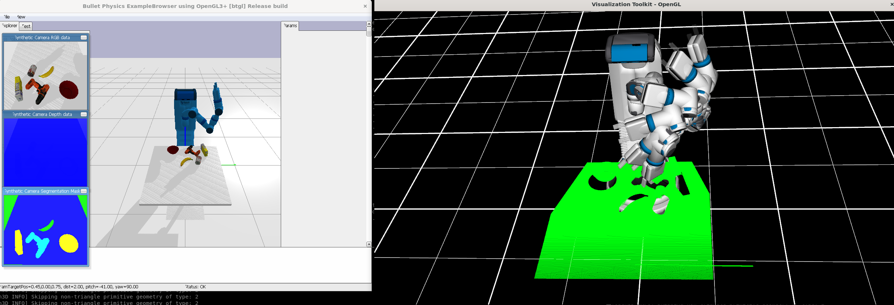

# GraspTrajOpt
Grasping Trajectory Optimization with Point Clouds

We introduce a new trajectory optimization method for robotic grasping based on a point-cloud representation of robots and task spaces. In our method, robots are represented by 3D points on their link surfaces. The task space of a robot is represented by a point cloud that can be obtained from depth sensors. Using the point-cloud representation, goal reaching in grasping can be formulated as point matching, while collision avoidance can be efficiently achieved by querying the signed distance values of the robot points in the signed distance field of the scene points. Consequently, a constrained non-linear optimization problem is formulated to solve the joint motion and grasp planning problem. The advantage of our method is that the point-cloud representation is general to be used with any robot in any environment. We demonstrate the effectiveness of our method by conducting experiments on a tabletop scene and a shelf scene for grasping with a Fetch mobile manipulator and a Franka Panda arm.

<video src="./pics/GTO.mp4" width="320" height="240" controls></video>

## Installation
```sh
# create conda environment
conda create -n gto python=3.9

# activate the environment
conda activate gto

# install dependencies
pip install -r requirement.txt
```

## Example Usage
  
1. Download the SceneReplica data from [here](https://utdallas.box.com/s/nsrkk2o27a9sb8jnd8xqq0a7bk2srsa8). Unzip it to the root directory of this project.

2. Run GTO planning with SceneReplica in PyBullet:
   ```Shell
   cd examples/
   python pybullet_gto_planning.py --robot panda --scene_type tabletop --data_dir ../scenereplica_data
   ```
   The command line args:
- `--robot` : From {"fetch", "panda"}
- `--scene_type` : From {"tabletop", "shelf"}
- `--data_dir` : The path for the SceneReplica data directory

<p align="center" width="100%">
   
</p>

##  Running with Real Robots
We provide some examples of using the planner with a Fetch robot for the SceneReplica benchmark:
[https://github.com/IRVLUTD/SceneReplica/tree/gto_planning](https://github.com/IRVLUTD/SceneReplica/tree/gto_planning)

1. Model-based grasping: [https://github.com/IRVLUTD/SceneReplica/blob/gto_planning/src/bench_model_based_grasping_gto.py](https://github.com/IRVLUTD/SceneReplica/blob/gto_planning/src/bench_model_based_grasping_gto.py)

2. Model-free grapsing: [https://github.com/IRVLUTD/SceneReplica/blob/gto_planning/src/bench_6dof_segmentation_grasping_gto.py](https://github.com/IRVLUTD/SceneReplica/blob/gto_planning/src/bench_6dof_segmentation_grasping_gto.py)

3. The shelf grasping experiment is conducted with [https://github.com/IRVLUTD/SceneReplica/blob/gto_planning/src/model_free_grasping_gto.py](https://github.com/IRVLUTD/SceneReplica/blob/gto_planning/src/model_free_grasping_gto.py)

## Note for adding a new robot
- If joint limits are not presented in the urdf file, urdf_parser_py.urdf will set the joint limits to 0s. Make sure every joint has limits in the urdf file.
